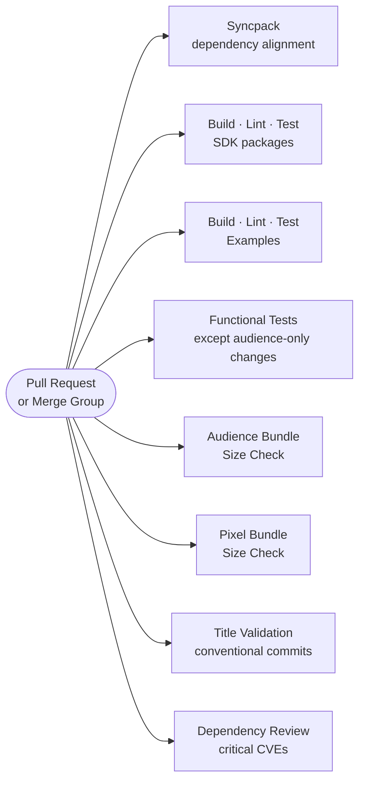
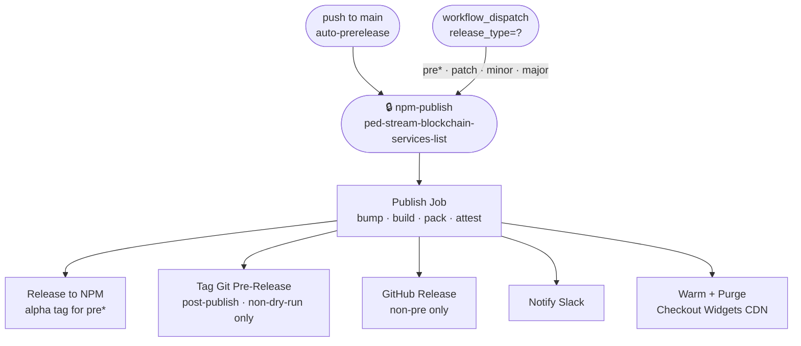
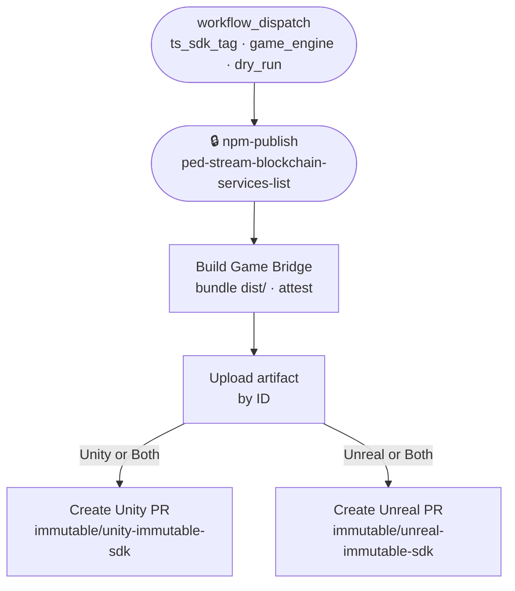
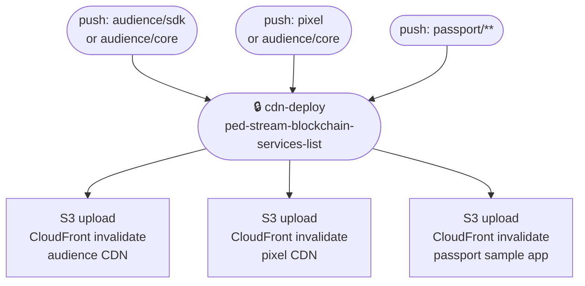

## PR / Merge Group

Runs on every PR and merge queue entry. Functional tests are skipped when all changed files are under `packages/audience/`. All jobs are automated - no manual gate.

---

## NPM Publish

Triggered automatically on push to `main` (prerelease) or manually via `workflow_dispatch` with a chosen release type.

---

## Game Bridge

Manual only. Builds the game bridge bundle at the chosen SDK tag and opens a PR in the Unity and/or Unreal SDK repos.

---

## CDN Deploys

Triggered on push to `main` (path-filtered) or manually. All three are prod deployments gated by the shared `cdn-deploy` environment.

