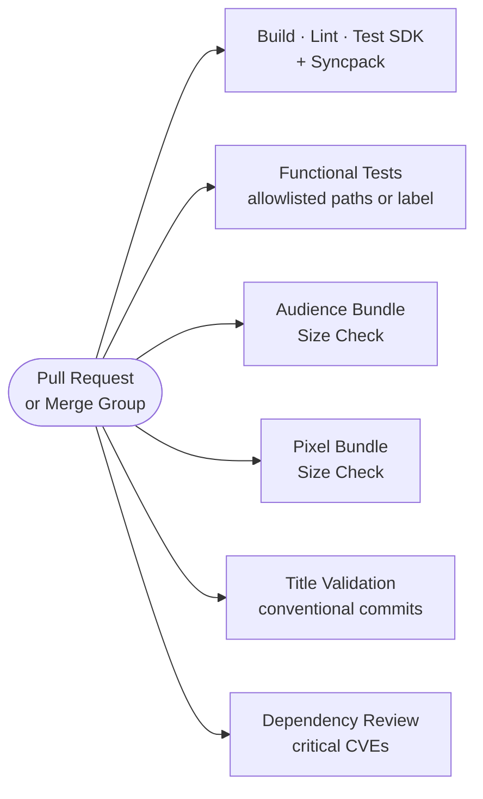
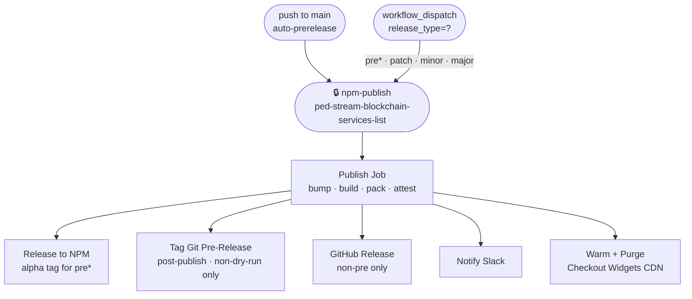
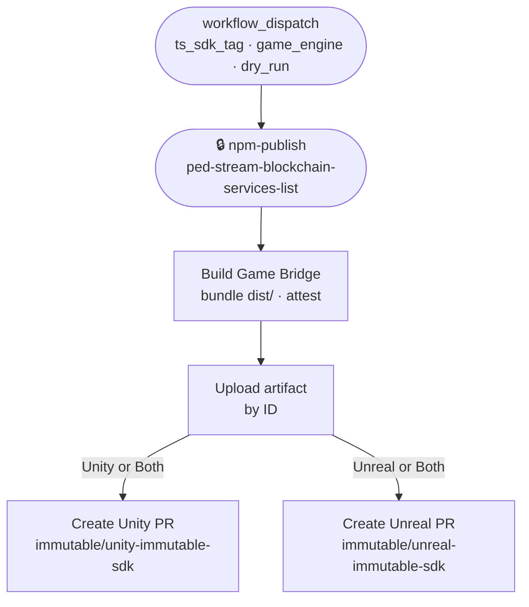
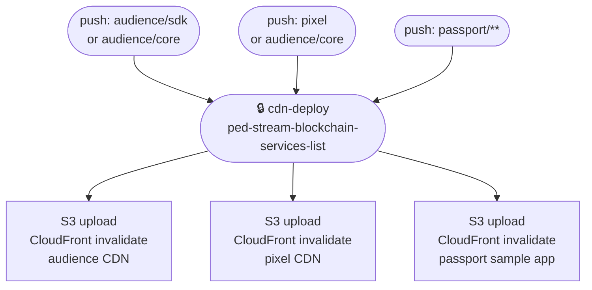

## PR / Merge Group

Runs on every PR and merge queue entry. Does **not** re-run on push to `main`
(merge queue is the final validation). Functional tests run only when allowlisted
paths change (`packages/orderbook/`, `sdk/`, `packages/config/`,
`packages/internal/metrics/`, `packages/internal/generated-clients/`,
`tests/func-tests/`, or this workflow), or when the PR has the `run-func-tests`
label. Syncpack runs inside the SDK job. All jobs are automated — no manual gate.

```mermaid
flowchart LR
    PR([Pull Request\nor Merge Group]) --> blt[Build · Lint · Test SDK\n+ Syncpack]
    PR --> func[Functional Tests\nallowlisted paths or label]
    PR --> ab[Audience Bundle\nSize Check]
    PR --> pb[Pixel Bundle\nSize Check]
    PR --> tv[Title Validation\nconventional commits]
    PR --> dr[Dependency Review\ncritical CVEs]
```

---

## NPM Publish

Triggered automatically on push to `main` (prerelease) or manually via `workflow_dispatch` with a chosen release type.

```mermaid
flowchart TD
    push([push to main\nauto-prerelease]) --> env_pub
    dispatch([workflow_dispatch\nrelease_type=?])
    dispatch -->|pre* · patch · minor · major| env_pub

    env_pub(["🔒 npm-publish\nped-stream-blockchain-services-list"])

    env_pub --> publish[Publish Job\nbump · build · pack · attest]

    publish --> npm[Release to NPM\nalpha tag for pre*]
    publish --> tag[Tag Git Pre-Release\npost-publish · non-dry-run only]
    publish --> gh[GitHub Release\nnon-pre only]
    publish --> slack[Notify Slack]
    publish --> cdn_cw[Warm + Purge\nCheckout Widgets CDN]
```

---

## Game Bridge

Manual only. Builds the game bridge bundle at the chosen SDK tag and opens a PR in the Unity and/or Unreal SDK repos.

```mermaid
flowchart TD
    dispatch([workflow_dispatch\nts_sdk_tag · game_engine · dry_run])
    dispatch --> env_gb

    env_gb(["🔒 npm-publish\nped-stream-blockchain-services-list"])
    env_gb --> build[Build Game Bridge\nbundle dist/ · attest]
    build --> upload[Upload artifact\nby ID]

    upload -->|Unity or Both| unity[Create Unity PR\nimmutable/unity-immutable-sdk]
    upload -->|Unreal or Both| unreal[Create Unreal PR\nimmutable/unreal-immutable-sdk]
```

---

## CDN Deploys

Triggered on push to `main` (path-filtered) or manually. All three are prod deployments gated by the shared `cdn-deploy` environment.

```mermaid
flowchart TD
    pa([push: audience/sdk\nor audience/core]) --> env
    pp([push: pixel\nor audience/core]) --> env
    ppass([push: passport/**]) --> env

    env(["🔒 cdn-deploy\nped-stream-blockchain-services-list"])

    env --> s3_a[S3 upload\nCloudFront invalidate\naudience CDN]
    env --> s3_p[S3 upload\nCloudFront invalidate\npixel CDN]
    env --> s3_pass[S3 upload\nCloudFront invalidate\npassport sample app]
```
