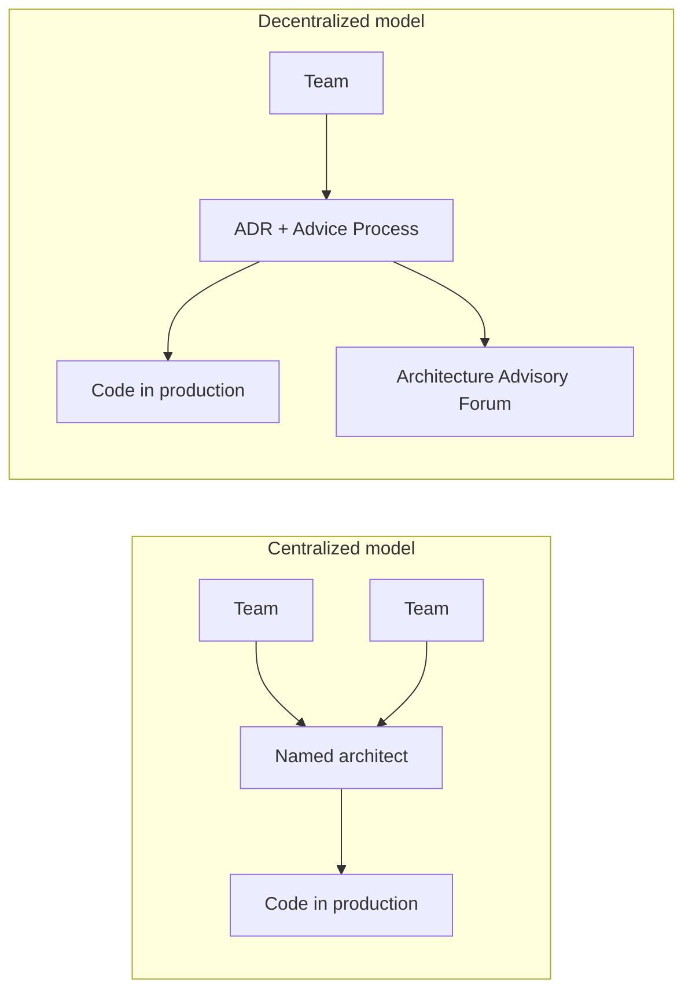

# Facilitating Software Architecture — Implementation Guide

**Source:** [Empowering Teams to Make Architectural Decisions](https://www.youtube.com/watch?v=BQYIBKIzY5g) — Andrew Harmel-Law, YOW! Australia 2025

**Further reading:**
- [Scaling the Practice of Architecture, Conversationally](https://martinfowler.com/articles/scaling-architecture-conversationally.html) (Martin Fowler, ~17 pages)
- [Facilitating Software Architecture](https://facilitatingsoftwarearchitecture.com) (O'Reilly book, ~560 pages)

---

## What this is

A decentralized approach to software architecture that replaces the ivory-tower or hands-on bottleneck architect with **distributed decision-making**. Teams make architectural decisions themselves, supported by lightweight records and open conversations.

The talk frames this as moving from a centralized, blocking, serial, push model to a decentralized, parallel, pull-based model.



---

## The three core practices

| Practice | Required? | Purpose |
| --- | --- | --- |
| **Advice Process** | Yes | How decisions get made |
| **Lightweight ADRs** | Yes | How decisions get thought through and recorded |
| **Architecture Advisory Forum (AAF)** | Strongly recommended | Where conversations happen in the open |

Two additional supporting elements from the Martin Fowler article (not covered in depth in the talk, but part of the full approach):

- **Team-sourced architectural principles** — SMART criteria aligned to business strategy
- **Technology radar** — Crowd-sourced view of your local tech landscape

---

## 1. The Advice Process

Borrowed from [Reinventing Organizations](https://www.reinventingorganizations.com/) / Frederic Laloux's work on teal/trust organizations.

### The rule

> **Anyone can make any architectural decision.**

### The qualifier (before deciding)

1. **Seek advice from all affected parties** — people who will inherit work, tickets, cost, or operational burden because of your decision.
2. **Seek advice from people with expertise** — including people not directly in the firing line, who have relevant experience.

### Critical distinctions

| Concept | What it means |
| --- | --- |
| **Advice ≠ permission** | You must listen and record advice; you are not required to follow it. |
| **Advice ≠ consensus** | You are not looking for everyone to agree. |
| **Advice ≠ opinion** | "Don't use Java" is an opinion. Advice answers *why* — reasoned thinking you can learn from. |
| **Responsibility moves with power** | If you decide, you are accountable for the outcome. |

### Who to consult

Build a checklist for your organization. Examples:

- Changing an API? → All consuming team leads
- Touching PII? → Data team, legal
- New cloud service? → Cloud/platform team, InfoSec
- UX flow change? → Product, UX lead
- Security impact? → CISO / InfoSec

**Actively seek people who will disagree with you.** Their stories and constraints surface blind spots.

---

## 2. Lightweight ADRs (Architecture Decision Records)

Based on [Michael Nygard's ADR format](https://cognitect.com/blog/2011/11/15/documenting-architecture-decisions), with tweaks from Andrew Harmel-Law.

ADRs are not just post-decision documentation — **writing the ADR helps you think**.

### Recommended structure

See [`templates/adr-template.md`](./templates/adr-template.md) for a copy-paste template.

| Section | Notes |
| --- | --- |
| **Title + unique ID** | After deciding, title = the decision ("Use short inventory IDs"). While drafting, title can be a question ("How should we generate inventory IDs?"). |
| **Decision** (near top) | Put the decision early so readers can stop if they only need the outcome. |
| **Context** | Forces and circumstances that led to the decision. The most useful section for learning to decide. |
| **Options considered** | Always more than one. "Do nothing" is valid. List pros **and** cons for **every** option — not just positives for your pick and negatives for the rest. |
| **Consequences** | Ramifications of the chosen option. |
| **Advice** | Who said what, and when. Reflect advice back into the ADR; acknowledge dissent even when you proceed anyway. |

### Where to store ADRs

Typically in your source repository alongside the code they affect. Use your team's existing docs tooling (Confluence, Notion, GitHub wiki, etc.) — the format matters more than the tool.

### How experienced architects contribute

You are no longer the default decider. Instead you:

- Help less experienced deciders frame context and options
- Point people to the right experts (including "that person maintaining the ancient system")
- Identify non-technical stakeholders (legal, regulatory, InfoSec)
- Review ADRs and offer advice — not veto power

---

## 3. Architecture Advisory Forum (AAF)

A weekly open meeting (~1 hour). **Not** an Architecture Review Board.

| Architecture Review Board | Architecture Advisory Forum |
| --- | --- |
| Seek permission / approval | Share intent; receive advice |
| Ego battles and compromise | Open learning and debate |
| Architects tear proposals apart | Deciders own the decision |
| Closed / gatekeeping | Open invite |

### Standing agenda

1. **Spikes / early warnings** — teams share upcoming decisions so others can offer knowledge early
2. **New proposed decisions** — presented via ADR by the accountable decider
3. **Revisit in-flight decisions** — timeboxed; allows late advice and learning from imperfect information
4. **Metrics / spend trends** (optional)
5. **Any other business**

### Rules of the forum

- Come with your ADR (draft or proposed). You are **not** asking for permission.
- Whoever offers advice **in the meeting** is responsible for writing it into the ADR. **If it isn't written down, it doesn't count.** This prevents weaponizing information asymmetry.
- Senior leaders (CTOs, etc.) are encouraged to **listen, not direct** — social status can override the advice process if they speak too forcefully.
- Watch the **long tail of ADRs** — decisions with lots of debate often signal systemic coupling that needs architectural attention.

### Who should attend

Open invite. Typical attendees:

- Delegates from each delivery team (not just leads — BAs, QAs, PMs welcome)
- InfoSec, legal, regulatory, product, UX, operations
- Anyone affected or with expertise
- People learning to make architectural decisions

---

## How to adopt this — step by step

### Phase 0: Prerequisites

- Leadership agrees to shift from centralized approval to distributed accountability
- Psychological safety exists (or you are willing to invest in building it)
- Teams have some autonomy over their technical choices

### Phase 1: Introduce the Advice Process (week 1–2)

1. Socialize the one rule + two qualifiers with engineering and leadership.
2. Publish a **consultation checklist** (affected parties + expertise by domain).
3. Explicitly state: **advice is not permission**; deciders are accountable.
4. Run a pilot with one team making one real decision using the process.

### Phase 2: Introduce ADRs (week 2–4)

1. Add the ADR template to your repo or wiki ([template provided](./templates/adr-template.md)).
2. Train teams on the format — especially multiple options with honest pros/cons.
3. Require advice to be captured in the ADR before a decision is marked "Adopted."
4. Have experienced architects review drafts and offer framing advice, not decisions.

### Phase 3: Start the Architecture Advisory Forum (week 4–6)

1. Book a recurring weekly 1-hour slot. Open calendar invite.
2. First sessions: teams present draft ADRs; practice recording advice live.
3. Celebrate good failures and changed minds publicly in the forum.
4. Track attendance diversity — avoid "usual suspects only."

### Phase 4: Add principles and radar (optional, month 2+)

From the full Martin Fowler article:

- Run a workshop to define 8–15 **SMART architectural principles** sourced from teams
- Build your own [Technology Radar](https://www.thoughtworks.com/radar/byor) to capture local adopt/hold/experiment/retire positions
- Reference principles and radar blips in ADRs; flag when a decision conflicts with a principle

### Phase 5: Operate and improve

- Decisions flow: need arises → open ADR → seek advice (1:1 and async) → present at AAF → adopt → implement → revisit if learning changes the picture
- Architects focus on **facilitating conversations**, not owning every decision
- Ruth Malan's framing: ensure the conversations that need to happen **are** happening — initiate, focus, or guide only when needed

---

## Failure modes and how to avoid them

### 1. Calling decisions "bad" instead of helping them ship

**Anti-pattern:** Senior architects veto or block decisions they disagree with.

**Fix:** Offer reasoned advice ("here is why I think this might fail because...") and genuinely leave the decision to the decider. The real test is code in production, not your opinion.

### 2. Old guard still deciding

**Anti-pattern:** You announced "anyone can decide" but the same three senior people still make every call. Teams don't believe the empowerment is real.

**Fix:** Actively step back. Encourage others to decide. Do not frown, withhold approval, or punish "wrong" choices.

### 3. Off-the-grid decisions

**Anti-pattern:** Teams decide in isolation — no ADR, no forum — because they fear being judged.

**Fix:** This is a failure of psychological safety, not the teams. Curate the space. Invite people in. Celebrate experimentation. Never punish someone for deciding without you.

### 4. No trust

**Anti-pattern:** Low trust environment where advice is ignored or weaponized.

**Fix:** Trust is a prerequisite. Open forums, written ADRs, solicited advice, and celebrated failures build trust over time. If trust is catastrophically low, fix that first or this approach will not work.

### 5. Exclusion / usual suspects

**Anti-pattern:** Only a core group participates; quieter voices are drowned out.

**Fix:** Watch who speaks. Amplify underrepresented voices. Balance influence away from tenure and hierarchy.

---

## Key principles to remember

| Principle | Detail |
| --- | --- |
| **Anybody, not everybody** | Anyone *can* decide; no one *must*. Developers still make small design choices daily. |
| **Culture-shaped** | Adapt to your teams, legacy, market, and organization. The process is intentionally lightweight. |
| **Conversations over diagrams** | Architecture lives in what developers understand and ship, not in PowerPoint. |
| **Point-in-time decisions** | Revisit when you learn more. ADRs are not immutable. |
| **Facilitation over control** | The architect's job becomes holding space for good conversations. |

---

## Roles in the new model

| Role | Old behavior | New behavior |
| --- | --- | --- |
| **Named / staff architect** | Central decider, bottleneck | Facilitator, advisor, systems thinker, connector to experts |
| **Team engineer** | Wait for architecture to "happen to them" | Can step up to decide with accountability |
| **Affected teams** | Passive recipients | Consulted for advice; may inherit consequences |
| **Senior leadership** | Approvers | Listeners; trust the process unless trust is broken |

---

## Checklist: your first architectural decision

Use this for a pilot decision with one team.

- [ ] Need identified — someone on the team owns the decision
- [ ] ADR opened (title as question, status = Draft)
- [ ] Context written — why now, what forces apply
- [ ] At least 2–3 options with honest pros/cons (including "do nothing")
- [ ] Affected parties identified and consulted
- [ ] Experts identified and consulted (including dissenters)
- [ ] All advice recorded in ADR with name and date
- [ ] Decision made and recorded; decider is accountable
- [ ] ADR presented at Architecture Advisory Forum
- [ ] Advice from forum captured in ADR
- [ ] Implementation started; learning fed back into ADR if needed

---

## Transcript tooling

This guide was produced from the talk transcript using [`youtube-transcript-api`](https://github.com/jdepoix/youtube-transcript-api).

```bash
pip install youtube-transcript-api
python examples/facilitating-software-architecture/scripts/fetch_youtube_transcript.py \
  --video-id BQYIBKIzY5g \
  --output examples/facilitating-software-architecture/transcript.txt
```

A cached transcript is available at [`transcript.txt`](./transcript.txt). Re-fetch locally if YouTube blocks cloud IPs.

---

## Summary

Andrew Harmel-Law's approach replaces centralized architectural gatekeeping with three lightweight practices:

1. **Advice Process** — anyone decides; seek advice from affected parties and experts first
2. **ADRs** — think, record, and share decisions openly
3. **Architecture Advisory Forum** — weekly open conversations; advice only, no permission

The architect's role shifts from **deciding** to **facilitating** — ensuring the right conversations happen, supporting less experienced deciders, and maintaining a whole-system view without becoming a bottleneck.

As Ruth Malan puts it: *"It is very much about ensuring that conversations that need to be happening are happening — not always initiating them, nor always helping to focus or navigate them, but ensuring they do happen … and guiding when needed."*
